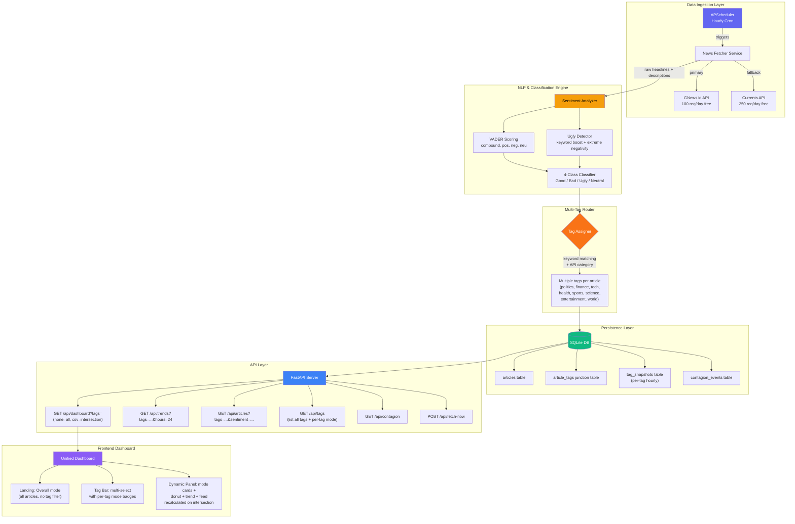

# NewsPulse — Real-Time News Sentiment Analysis Dashboard

> **Deadline:** 1.5 days (by EOD Aug 26, 2026)
> **Goal:** Build a full-stack app that fetches global news every hour, classifies each headline into **Good / Bad / Ugly / Neutral**, and presents trends on a stunning live dashboard with **interactive multi-select domain tags** that filter articles by intersection and dynamically recompute the sentiment mode.

---

## 🏆 USP — "Cross-Sector Sentiment Contagion" (Stakeholder Value)

Every sentiment tool shows you *what* the mood is. NewsPulse shows you **where it's going next**.

The core insight: sentiment doesn't stay in a silo. When political news turns ugly (e.g., sanctions, election crises, policy shocks), financial markets follow within hours. When financial news crashes (e.g., bank failures, rate hikes), political blame narratives amplify. **NewsPulse is the first lightweight tool that visualises this cross-domain ripple effect in real-time.**

### The Contagion Signal

```
  Politics turns Ugly at 2pm  ──────►  Finance shifts Bad→Ugly by 5pm
  ┌────────────────────────────────────────────────────────────┐
  │  CONTAGION ALERT: Political sentiment collapse detected.   │
  │  Historical pattern: Finance follows within 2-4 hours.     │
  │  Current Finance mood: Bad (compound: -0.18)               │
  │  Predicted shift: → Ugly within ~3 hours                   │
  └────────────────────────────────────────────────────────────┘
```

This is calculated simply by comparing sentiment trends between domain tags over sliding time windows — no ML model needed, just correlation tracking on the data we're already collecting.

### Why stakeholders care:

| Feature | Stakeholder Value |
|---|---|
| **Contagion Alerts** | "Politics just went ugly — historically, Finance follows in 3 hours." Investment analysts get a head start to hedge. PR teams pre-draft statements before the wave hits their domain |
| **Multi-Tag Intersection Filtering** | Select `Politics` + `Finance` together to see only articles tagged with BOTH — instantly reveals cross-domain stories driving sentiment contagion. No other free tool does this |
| **Per-Tag Mode Badges** | Each domain tag shows its own mini mode indicator (😊/😞/💀/😐) at a glance — stakeholders scan 8 tags in 2 seconds to find trouble spots |
| **Dynamic Mode Recalculation** | When you select tags, the entire dashboard (mode, donut, trend, feed) recalculates live on the intersection subset. Not a static report — a living analytical instrument |
| **Zero-Cost Operation** | Runs entirely on free APIs and open-source NLP — no vendor lock-in, no surprise invoices |

> **One-liner pitch:** *"NewsPulse doesn't just tell you the mood — it tells you which domain is about to infect the next."*

---

## High-Level Architecture



---

## Low-Level Component Design

### 1. News Fetcher Service

#### Primary API: [GNews.io](https://gnews.io/) (Free Tier)
- **Limits:** 100 requests/day, 10 articles/request
- **Endpoint:** `https://gnews.io/api/v4/top-headlines?category={cat}&lang=en&apikey={KEY}`
- **Categories fetched:** `general`, `world`, `business`, `technology`, `entertainment`, `sports`, `science`, `health`
- **Response fields:** `title`, `description`, `content`, `url`, `image`, `publishedAt`, `source.name`

#### Fallback API: [Currents API](https://currentsapi.services/) (Free Tier)
- **Limits:** 250 requests/day
- **Endpoint:** `https://api.currentsapi.services/v1/latest-news?language=en&apiKey={KEY}`
- **Response fields:** `title`, `description`, `published`, `url`, `image`, `category`

#### Fetch Strategy (rotating categories to stay within limits):
```
Hourly cycle — rotate through 4 categories per hour:
  Hour 0: general, world, business, technology    → 4 requests
  Hour 1: entertainment, sports, science, health  → 4 requests
  Hour 2: general, world, business, technology    → 4 requests (repeat)
  ...

Total: 4 requests/hour × 24 hours = 96 requests/day ✅ (under GNews's 100)
Each request returns 10 articles → ~40 new articles/hour
```

#### Multi-Tag Assignment Logic
Each article can receive **1 or more tags**. An article about "government financial policy" gets BOTH `politics` AND `finance`.

```python
TAG_KEYWORDS = {
    'politics': {
        'election', 'president', 'congress', 'senate', 'parliament', 'minister',
        'legislation', 'sanctions', 'diplomacy', 'geopolitical', 'referendum',
        'campaign', 'bipartisan', 'democrat', 'republican', 'policy', 'governor',
        'supreme court', 'impeachment', 'treaty', 'tariff', 'regulation',
        'government', 'vote', 'opposition', 'coalition', 'mandate'
    },
    'finance': {
        'stock', 'market', 'shares', 'investor', 'gdp', 'inflation', 'fed',
        'interest rate', 'earnings', 'revenue', 'ipo', 'nasdaq', 'dow jones',
        'wall street', 'hedge fund', 'cryptocurrency', 'bitcoin', 'bond',
        'recession', 'bailout', 'dividend', 'merger', 'acquisition', 'forex',
        'banking', 'economy', 'fiscal', 'monetary'
    },
    'tech': {
        'ai', 'artificial intelligence', 'startup', 'software', 'hardware',
        'silicon valley', 'cybersecurity', 'data breach', 'cloud', 'saas',
        'blockchain', 'robotics', 'quantum', 'semiconductor', 'chip',
        'apple', 'google', 'microsoft', 'meta', 'tesla', 'openai', 'nvidia'
    },
    'health': {
        'vaccine', 'pandemic', 'hospital', 'disease', 'treatment', 'drug',
        'clinical trial', 'fda', 'cancer', 'mental health', 'virus',
        'outbreak', 'surgery', 'pharma', 'diagnosis', 'therapy', 'who'
    },
    'sports': {
        'championship', 'tournament', 'league', 'nba', 'nfl', 'fifa',
        'olympics', 'premier league', 'cricket', 'tennis', 'formula 1',
        'athlete', 'coach', 'playoff', 'stadium', 'match', 'score'
    },
    'science': {
        'nasa', 'space', 'climate', 'research', 'discovery', 'experiment',
        'physicist', 'biology', 'genome', 'fossil', 'asteroid', 'mars',
        'evolution', 'species', 'emission', 'renewable', 'carbon'
    },
    'entertainment': {
        'movie', 'film', 'box office', 'netflix', 'celebrity', 'album',
        'concert', 'grammy', 'oscar', 'emmy', 'streaming', 'tv show',
        'actor', 'singer', 'director', 'premiere', 'trailer'
    },
    'world': {
        'united nations', 'nato', 'eu', 'refugee', 'humanitarian', 'war',
        'conflict', 'ceasefire', 'peacekeeping', 'border', 'migration',
        'embassy', 'summit', 'bilateral', 'foreign affairs', 'g7', 'g20'
    }
}

# GNews category → guaranteed base tag
CATEGORY_TO_TAG = {
    'general': None,        # no guaranteed tag, keyword-only
    'world': 'world',
    'nation': 'politics',
    'business': 'finance',
    'technology': 'tech',
    'entertainment': 'entertainment',
    'sports': 'sports',
    'science': 'science',
    'health': 'health',
}

def assign_tags(category: str, title: str, description: str) -> list[str]:
    """Assign multiple domain tags to an article."""
    tags = set()
    text = f"{title} {description}".lower()

    # 1. Base tag from API category
    base_tag = CATEGORY_TO_TAG.get(category)
    if base_tag:
        tags.add(base_tag)

    # 2. Keyword scan for additional tags
    for tag_name, keywords in TAG_KEYWORDS.items():
        hits = sum(1 for kw in keywords if kw in text)
        if hits >= 2:  # threshold: need ≥2 keyword matches
            tags.add(tag_name)

    # 3. Fallback: if no tags assigned, mark as 'general'
    if not tags:
        tags.add('general')

    return sorted(tags)
```

#### [NEW] `app/services/news_fetcher.py`
```python
# Key responsibilities:
# - Rotate through 8 GNews categories across hourly cycles
# - Assign MULTIPLE domain tags per article (keyword + category based)
# - Fallback to Currents API if GNews rate-limited
# - Deduplicate articles by URL hash
# - Return list of TaggedArticle dataclass objects (article + tags list)
```

---

### 2. Sentiment Analysis Engine

#### VADER + Ugly Detector Hybrid Approach

**Step 1 — VADER Scoring:**
```python
from vaderSentiment.vaderSentiment import SentimentIntensityAnalyzer
analyzer = SentimentIntensityAnalyzer()
scores = analyzer.polarity_scores(text)  # Returns {neg, neu, pos, compound}
```

**Step 2 — 4-Class Classification Logic:**
```python
UGLY_KEYWORDS = {
    'scandal', 'corruption', 'massacre', 'fraud', 'abuse', 'murder',
    'assault', 'trafficking', 'genocide', 'torture', 'rape', 'terrorist',
    'bombing', 'shooting', 'crash', 'catastrophe', 'explosion', 'scam',
    'embezzlement', 'coverup', 'crisis', 'outrage', 'horrific', 'gruesome',
    'atrocity', 'devastating', 'predator', 'exploitation', 'collapse'
}

def classify(text: str, compound: float) -> str:
    text_lower = text.lower()
    ugly_hits = sum(1 for kw in UGLY_KEYWORDS if kw in text_lower)

    # UGLY: Strong negativity + disturbing keywords
    if compound <= -0.3 and ugly_hits >= 1:
        return "ugly"
    if compound <= -0.5 and ugly_hits >= 0:
        return "ugly"  # Extremely negative even without keywords

    # BAD: Moderately negative
    if compound <= -0.05:
        return "bad"

    # GOOD: Positive
    if compound >= 0.05:
        return "good"

    # NEUTRAL: Everything else
    return "neutral"
```

**Step 3 — Cross-Domain Contagion Detection:**
```python
def detect_contagion(tag_snapshots: dict[str, list]) -> list[ContagionEvent]:
    """
    Compare sentiment trends between domain tags over a sliding window.

    Checks all tag-pairs (e.g. politics↔finance, finance↔tech, politics↔world).

    Logic:
    1. If Tag A's avg_compound drops by > 0.3 in the last 2 hours
       AND Tag B's avg_compound is still stable (change < 0.1)
       → Emit contagion alert: "Tag A → Tag B ripple likely"

    2. If BOTH are dropping simultaneously
       → Emit alert: "Simultaneous cross-domain decline"

    Returns list of ContagionEvent(source_tag, target_tag, severity, message)
    """
```

**Step 4 — Dynamic Mode Computation for Tag Intersection:**
```python
def compute_intersection_mode(articles: list[dict]) -> dict:
    """
    Given a filtered list of articles (already intersected by tags),
    recompute the overall sentiment mode from scratch.

    Returns {
        'dominant_mode': 'ugly',        # mode with highest count
        'good_count': 12,
        'bad_count': 8,
        'ugly_count': 15,
        'neutral_count': 5,
        'avg_compound': -0.34,
        'total': 40
    }

    This is called dynamically by the API — NOT pre-computed.
    The mode is always fresh for the current tag selection.
    """
```

#### [NEW] `app/services/sentiment_analyzer.py`
- `analyze_article(title, description) → SentimentResult`
- `classify_sentiment(compound, text) → "good" | "bad" | "ugly" | "neutral"`
- `detect_contagion(tag_snapshots) → list[ContagionEvent]`
- `compute_intersection_mode(articles) → ModeResult`

---

### 3. Database Schema (SQLite)

#### [NEW] `app/database/schema.sql`

```sql
-- Core articles table (tag-agnostic — tags live in junction table)
CREATE TABLE IF NOT EXISTS articles (
    id INTEGER PRIMARY KEY AUTOINCREMENT,
    url_hash TEXT UNIQUE NOT NULL,          -- SHA256 of URL for dedup
    title TEXT NOT NULL,
    description TEXT,
    source_name TEXT,
    api_category TEXT,                      -- original GNews/Currents category
    url TEXT NOT NULL,
    image_url TEXT,
    published_at TIMESTAMP,
    fetched_at TIMESTAMP DEFAULT CURRENT_TIMESTAMP,

    -- Sentiment scores (computed once at ingest, never changes)
    compound_score REAL NOT NULL,
    positive_score REAL NOT NULL,
    negative_score REAL NOT NULL,
    neutral_score REAL NOT NULL,
    sentiment_label TEXT NOT NULL,          -- good, bad, ugly, neutral
    ugly_keyword_count INTEGER DEFAULT 0
);

-- Junction table: many-to-many between articles and tags
CREATE TABLE IF NOT EXISTS article_tags (
    article_id INTEGER NOT NULL,
    tag TEXT NOT NULL,                      -- politics, finance, tech, health, etc.
    PRIMARY KEY (article_id, tag),
    FOREIGN KEY (article_id) REFERENCES articles(id) ON DELETE CASCADE
);

-- Per-tag hourly aggregated snapshots (for trend charts & contagion)
CREATE TABLE IF NOT EXISTS tag_snapshots (
    id INTEGER PRIMARY KEY AUTOINCREMENT,
    snapshot_time TIMESTAMP NOT NULL,
    tag TEXT NOT NULL,                      -- politics, finance, tech, etc.
    total_articles INTEGER,
    good_count INTEGER DEFAULT 0,
    bad_count INTEGER DEFAULT 0,
    ugly_count INTEGER DEFAULT 0,
    neutral_count INTEGER DEFAULT 0,
    avg_compound REAL,
    UNIQUE(snapshot_time, tag)
);

-- Cross-domain contagion events
CREATE TABLE IF NOT EXISTS contagion_events (
    id INTEGER PRIMARY KEY AUTOINCREMENT,
    detected_at TIMESTAMP DEFAULT CURRENT_TIMESTAMP,
    source_tag TEXT NOT NULL,               -- tag that moved first
    target_tag TEXT NOT NULL,               -- tag predicted to follow
    severity TEXT DEFAULT 'moderate',       -- low, moderate, high
    source_compound_delta REAL,             -- how much source shifted
    target_compound_current REAL,           -- target's current compound
    message TEXT,
    resolved BOOLEAN DEFAULT 0             -- did the prediction come true?
);

-- Indexes
CREATE INDEX IF NOT EXISTS idx_article_tags_tag ON article_tags(tag);
CREATE INDEX IF NOT EXISTS idx_article_tags_article ON article_tags(article_id);
CREATE INDEX IF NOT EXISTS idx_articles_fetched ON articles(fetched_at);
CREATE INDEX IF NOT EXISTS idx_articles_sentiment ON articles(sentiment_label);
CREATE INDEX IF NOT EXISTS idx_snapshots_tag_time ON tag_snapshots(tag, snapshot_time);
CREATE INDEX IF NOT EXISTS idx_contagion_time ON contagion_events(detected_at);
```

#### Key Query: Intersection Filtering

```sql
-- Find articles that have ALL of the selected tags (intersection)
-- Example: tags = ['politics', 'finance']
SELECT a.*
FROM articles a
JOIN article_tags at1 ON a.id = at1.article_id AND at1.tag = 'politics'
JOIN article_tags at2 ON a.id = at2.article_id AND at2.tag = 'finance'
ORDER BY a.fetched_at DESC
LIMIT 50;

-- Generalised (built dynamically in Python for N tags):
-- For each selected tag, add a JOIN. Only articles matching ALL joins survive.
```

#### [NEW] `app/database/db.py`
- `init_db()` — Create tables
- `insert_article(article, tags)` — Insert article + junction rows
- `insert_tag_snapshot(snapshot)` — Per-tag hourly aggregate
- `get_dashboard(tags=None)` — If no tags: all articles. If tags: intersection query. Returns counts + avg_compound computed on the fly
- `get_trends(tags=None, hours=24)` — Trend data. If tags given, recomputes from intersection
- `get_articles(tags=None, sentiment=None, limit=50)` — Intersection-filtered article feed
- `get_all_tags_with_modes()` — Returns every tag + its current dominant mode (for tag bar badges)
- `insert_contagion_event(event)` — Log detected contagion
- `get_active_contagion_alerts()` — Unresolved contagion events

---

### 4. FastAPI Backend

#### [NEW] `app/main.py`

```python
# Endpoints:
#
# GET  /api/dashboard                     → Overall mode (all articles, no filter)
# GET  /api/dashboard?tags=politics       → Mode for politics-only articles
# GET  /api/dashboard?tags=politics,finance → Mode for articles tagged BOTH (intersection)
#
# GET  /api/trends?hours=24               → Overall trend (all articles)
# GET  /api/trends?tags=finance&hours=24  → Trend for finance articles
# GET  /api/trends?tags=politics,finance&hours=24 → Trend for intersection
#
# GET  /api/articles?limit=50             → All articles
# GET  /api/articles?tags=tech&sentiment=ugly&limit=20 → Filtered feed
# GET  /api/articles?tags=politics,finance&limit=30    → Intersection feed
#
# GET  /api/tags                          → List all tags with per-tag mode badge
#                                           Returns: [{tag: "politics", mode: "ugly", count: 45}, ...]
#
# GET  /api/contagion                     → Active cross-domain contagion alerts
# POST /api/fetch-now                     → Manually trigger a fetch cycle
# GET  /                                  → Serve static frontend

# The `tags` query param is ALWAYS comma-separated.
# No tags = all articles (landing page view).
# Multiple tags = intersection (AND logic, not OR).
# Mode is recomputed dynamically on the filtered result set — never stale.
```

#### [NEW] `app/services/scheduler.py`
- Configure APScheduler with `BackgroundScheduler`
- Register hourly job: `fetch_and_analyze` → create per-tag snapshots → `detect_contagion`
- Handle graceful shutdown

---

### 5. Frontend Dashboard

#### Design Philosophy
- **Glassmorphism** with frosted-glass cards on a dark gradient background
- **Google Font**: Inter for clean typography
- **Color Palette**:
  - Good: `#10B981` (emerald green)
  - Bad: `#EF4444` (red)
  - Ugly: `#7C3AED` (purple — intentionally NOT red, to distinguish from "bad")
  - Neutral: `#6B7280` (gray)
  - Background: `linear-gradient(135deg, #0f0c29, #302b63, #24243e)`
- **Tag colors** — each tag gets a subtle unique accent for its pill badge:
  - Politics: `#F59E0B` (amber)
  - Finance: `#06B6D4` (cyan)
  - Tech: `#8B5CF6` (violet)
  - Health: `#EC4899` (pink)
  - Sports: `#22C55E` (lime)
  - Science: `#14B8A6` (teal)
  - Entertainment: `#F97316` (orange)
  - World: `#3B82F6` (blue)
- **Charts**: Chart.js (CDN, zero build step)
- **Animations**: CSS keyframes for pulse effects, smooth transitions, counter animations

#### [NEW] `app/static/index.html`

Layout — Unified dashboard with interactive tag bar:
```
┌──────────────────────────────────────────────────────────────────────┐
│  🌐 NewsPulse        "Cross-Sector Sentiment Intelligence"          │
│  ⏱ Last fetch: 2m ago                                               │
│──────────────────────────────────────────────────────────────────────│
│                                                                      │
│  ┌─ 🔴 CONTAGION ALERT ─────────────────────────────────────────┐  │
│  │  ⚠ Politics → Finance ripple detected.                        │  │
│  │  Political ugly surge at 2pm. Finance may follow by 5pm.      │  │
│  │  [Dismiss]                                        [Details]    │  │
│  └───────────────────────────────────────────────────────────────┘  │
│                                                                      │
│  ╔══════════════════════════════════════════════════════════════╗    │
│  ║  OVERALL MOOD   ║  😊 42  GOOD  ║  😞 23  BAD  ║           ║    │
│  ║  (all news)     ║  💀  8  UGLY  ║  😐 27  NEU  ║  Mode: 😊 ║    │
│  ╚══════════════════════════════════════════════════════════════╝    │
│                                                                      │
│  ┌─ 🏷️ DOMAIN TAGS ─ click to filter (multi-select) ────────────┐ │
│  │                                                                │  │
│  │  ┌──────────┐ ┌──────────┐ ┌──────────┐ ┌──────────┐         │  │
│  │  │ 🏛 Pol.  │ │ 💰 Fin.  │ │ 💻 Tech  │ │ 🏥 Health│         │  │
│  │  │ 😞 BAD   │ │ 😊 GOOD  │ │ 💀 UGLY  │ │ 😐 NEUT  │         │  │
│  │  │ (45)     │ │ (38)     │ │ (22)     │ │ (15)     │         │  │
│  │  └──────────┘ └──────────┘ └──────────┘ └──────────┘         │  │
│  │  ┌──────────┐ ┌──────────┐ ┌──────────┐ ┌──────────┐         │  │
│  │  │ ⚽ Sport │ │ 🔬 Sci.  │ │ 🎬 Ent.  │ │ 🌍 World │         │  │
│  │  │ 😊 GOOD  │ │ 😊 GOOD  │ │ 😐 NEUT  │ │ 😞 BAD   │         │  │
│  │  │ (30)     │ │ (18)     │ │ (25)     │ │ (40)     │         │  │
│  │  └──────────┘ └──────────┘ └──────────┘ └──────────┘         │  │
│  │                                                                │  │
│  │  Selected: [Politics ✕] [Finance ✕]  ← "Clear All"           │  │
│  │  Showing: 12 articles in intersection                          │  │
│  └────────────────────────────────────────────────────────────────┘  │
│                                                                      │
│  ┌─ FILTERED VIEW (recalculates based on selected tags) ─────────┐ │
│  │                                                                │  │
│  │  ┌─────────┐ ┌─────────┐ ┌─────────┐ ┌─────────┐             │  │
│  │  │  😊  3  │ │  😞  4  │ │  💀  4  │ │  😐  1  │             │  │
│  │  │  GOOD   │ │  BAD    │ │  UGLY   │ │ NEUTRAL │             │  │
│  │  └─────────┘ └─────────┘ └─────────┘ └─────────┘             │  │
│  │                                                                │  │
│  │  ┌──────────────────┐  ┌──────────────────────────────────┐   │  │
│  │  │  Donut Chart     │  │  24h Trend Line                  │   │  │
│  │  │  (intersection)  │  │  (intersection compound/time)    │   │  │
│  │  └──────────────────┘  └──────────────────────────────────┘   │  │
│  │                                                                │  │
│  │  ┌─ 📰 Article Feed ──────────────────────────────────────┐   │  │
│  │  │  [All] [😊 Good] [😞 Bad] [💀 Ugly] [😐 Neutral]      │   │  │
│  │  │                                                         │   │  │
│  │  │  💀 UGLY  "Lawmakers accused of insider trading..."     │   │  │
│  │  │          🏷 politics  🏷 finance                        │   │  │
│  │  │  😞 BAD   "Policy uncertainty rattles markets..."       │   │  │
│  │  │          🏷 politics  🏷 finance                        │   │  │
│  │  │  😊 GOOD  "Bipartisan budget deal boosts stocks..."     │   │  │
│  │  │          🏷 politics  🏷 finance                        │   │  │
│  │  └────────────────────────────────────────────────────────┘   │  │
│  └────────────────────────────────────────────────────────────────┘  │
└──────────────────────────────────────────────────────────────────────┘
```

#### Interaction Flow

1. **Landing (no tags selected):** Dashboard shows the OVERALL mode across all news. All 8 tag pills visible with their individual mode badges. Article feed shows all articles.

2. **Single tag selected (e.g., click "Finance"):** Dashboard mode recalculates to show only finance-tagged articles. Donut, trend, and feed update. The tag pill gets a highlighted/active state.

3. **Multiple tags selected (e.g., "Politics" + "Finance"):** Dashboard shows the **intersection** — only articles tagged with BOTH. Mode, donut, trend, and feed all recompute on this smaller subset. A "Selected" bar shows active tags with ✕ buttons. The count shows how many articles match the intersection.

4. **Clear All:** Resets to the landing/overall view.

#### [NEW] `app/static/style.css`
- CSS variables for 4-sentiment colors + 8 tag accent colors
- Glassmorphism card styles (`backdrop-filter: blur(16px)`)
- Tag pill component: rounded pill with accent color border, mode emoji badge, article count, active/inactive states
- Selected tags bar with ✕ dismiss buttons
- Overall mood hero section with large mode indicator
- Responsive grid: tag pills wrap on mobile (2 per row), desktop (4 per row)
- Pulse animation for "ugly" counts
- Contagion alert banner with red glow
- Smooth transitions when tag selection changes (CSS `transition` on card opacity/transform)
- Dark gradient background

#### [NEW] `app/static/app.js`
- On load: `GET /api/tags` → render tag pills with mode badges; `GET /api/dashboard` → render overall mode
- `selectedTags = []` state array
- Tag click handler: toggle tag in `selectedTags`, re-fetch `/api/dashboard?tags=X,Y` and `/api/articles?tags=X,Y`
- When `selectedTags` is empty → show overall mode
- When `selectedTags` has entries → show intersection mode
- Chart.js: 1 donut + 1 trend line, both destroyed and re-created on tag change
- Auto-refresh every 60 seconds (re-fetches with current `selectedTags`)
- Animated number counters on mode card updates
- Sentiment filter buttons in article feed (toggles `&sentiment=` param)

---

### 6. Free API & Dataset Details

#### APIs (Free, No Credit Card Required)

| API | Free Tier | Use |
|---|---|---|
| **[GNews.io](https://gnews.io/)** | 100 req/day, 10 articles/req | Primary data source |
| **[Currents API](https://currentsapi.services/)** | 250 req/day | Fallback data source |

#### Dataset (For Benchmarking & Training)

| Dataset | Source | Size | Labels |
|---|---|---|---|
| **[FinancialPhraseBank](https://www.kaggle.com/datasets/ankurzing/sentiment-analysis-for-financial-news)** | Kaggle | 4,840 sentences | Positive, Negative, Neutral |
| **[News Sentiment Analysis](https://www.kaggle.com/datasets/gpiosenka/news-sentiment-analysis)** | Kaggle | ~10,000 articles | Positive, Negative, Neutral |
| **[NewsMTSC](https://www.kaggle.com/datasets/hb20007/newsmtsc)** | Kaggle | ~11,000 sentences | Human-coded multi-target sentiment |

> [!TIP]
> We use FinancialPhraseBank during development to validate our VADER thresholds. The live app builds its own dataset over time in SQLite, which can later be exported for model fine-tuning.

---

## Project Structure

```
code_centric/news-pulse/
├── app/
│   ├── __init__.py
│   ├── main.py                    # FastAPI app, routes, startup
│   ├── config.py                  # Environment variables, tag keywords, thresholds
│   ├── models.py                  # Pydantic models / dataclasses
│   ├── database/
│   │   ├── __init__.py
│   │   ├── db.py                  # SQLite connection, intersection queries
│   │   └── schema.sql             # Tables: articles, article_tags, tag_snapshots, contagion
│   ├── services/
│   │   ├── __init__.py
│   │   ├── news_fetcher.py        # GNews + Currents client, multi-tag assigner
│   │   ├── sentiment_analyzer.py  # VADER + Ugly + Contagion + intersection mode calc
│   │   └── scheduler.py           # APScheduler config
│   └── static/
│       ├── index.html             # Unified dashboard with tag bar
│       ├── style.css              # Glassmorphism + tag pill components
│       └── app.js                 # Tag selection state, dynamic re-rendering
├── tests/
│   ├── test_sentiment.py          # Unit tests for classifier + contagion
│   ├── test_tags.py               # Unit tests for multi-tag assignment + intersection
│   └── test_fetcher.py            # API integration tests
├── data/
│   └── README.md                  # Links to Kaggle datasets for benchmarking
├── requirements.txt
├── .env.example                   # GNEWS_API_KEY, CURRENTS_API_KEY
└── README.md
```

---

## Timeline (1.5 Days)

### Day 1 — Morning (4h): Foundation
| Time | Task | Details |
|---|---|---|
| 0:00–0:30 | Project setup | `venv`, `requirements.txt`, `.env`, folder structure |
| 0:30–1:30 | Database layer | SQLite schema (articles + article_tags junction + tag_snapshots + contagion), `db.py` with intersection query builder |
| 1:30–2:30 | News Fetcher | GNews + Currents clients, multi-tag assignment logic, dedup |
| 2:30–4:00 | Sentiment Engine | VADER, ugly detector, classifier, contagion detection, `compute_intersection_mode()` |

### Day 1 — Afternoon (4h): Backend + Frontend Shell
| Time | Task | Details |
|---|---|---|
| 4:00–5:30 | FastAPI routes | Tag-parameterised endpoints, `/api/tags` with mode badges, intersection logic, CORS |
| 5:30–6:00 | Scheduler | APScheduler hourly job → fetch → tag → analyze → snapshot → contagion |
| 6:00–8:00 | Frontend HTML/CSS | Unified layout, overall mood hero, tag pill bar, filtered view panel, glassmorphism, dark theme |

### Day 2 — Morning (4h): Frontend Logic + Polish
| Time | Task | Details |
|---|---|---|
| 0:00–2:00 | Tag interaction + Charts | `selectedTags` state management, dynamic re-fetch, Chart.js donut + trend line rebuild on tag change |
| 2:00–3:00 | Live updates | Auto-refresh, animated counters, sentiment filter buttons, tag clear-all |
| 3:00–4:00 | Contagion UI + polish | Alert banner, tag transition animations, hover effects, loading states |

### Day 2 — Afternoon (2h): Testing + Documentation
| Time | Task | Details |
|---|---|---|
| 4:00–5:00 | Testing | Unit tests for classifier + tag assignment + intersection queries + contagion |
| 5:00–6:00 | README + polish | Setup instructions, screenshots, final bug fixes |

---

## Dependencies (`requirements.txt`)

```
fastapi==0.115.*
uvicorn[standard]==0.34.*
apscheduler==3.10.*
vaderSentiment==3.3.*
httpx==0.28.*
python-dotenv==1.0.*
```

> [!NOTE]
> No heavy ML frameworks needed. VADER is a lightweight lexicon-based analyzer (~1MB). Chart.js is loaded via CDN. SQLite is built into Python. Total dependency footprint is minimal.

---

## Verification Plan

### Automated Tests
```bash
# Unit tests for sentiment classifier + tag assignment + intersection mode
python -m pytest tests/ -v
```

### Manual Verification
1. Start the server with `uvicorn app.main:app --reload`
2. Verify the dashboard loads at `http://localhost:8000` showing overall mode
3. Click "Fetch Now" to trigger an immediate data pull
4. Verify all 8 tag pills render with correct per-tag mode badges
5. Click a single tag (e.g., "Finance") — verify mode cards, donut, trend, and feed update for finance-only articles
6. Click a second tag (e.g., "Politics") — verify the view narrows to the intersection (articles tagged BOTH)
7. Verify the "Selected" bar shows active tags with ✕ buttons
8. Click "Clear All" — verify dashboard returns to overall view
9. Wait 1 hour (or adjust scheduler to 1 minute for testing) — verify new snapshots
10. Verify contagion alert appears when simulated with test data

---

## Open Questions

> [!NOTE]
> **Deployment:** The plan targets local development. If you want deployment (e.g., to a free tier like Render or Railway), let me know and I'll add a `Dockerfile` and deployment instructions.
