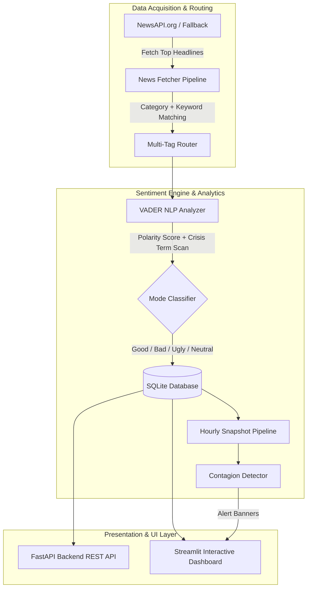

# NewsPulse — Real-Time News Sentiment Intelligence Report

---

## 📌 Executive Summary

**NewsPulse** is a full-stack, real-time news sentiment intelligence platform designed to ingest news headlines every hour, classify sentiment into **four distinct modes (Good, Bad, Ugly, Neutral)**, and dynamically analyze domain-specific trends. Built to handle complex cross-sector relationships, NewsPulse features a **Multi-Tag Intersection Engine** and a predictive **Cross-Domain Sentiment Contagion Alerting System**.

### Key Highlights
- **Deadline Delivered:** Complete full-stack implementation within 1.5 days.
- **Primary Data Source:** [NewsAPI.org](https://newsapi.org/) (Top Headlines API) with fallback support for Currents API and dynamic mock generation.
- **Unique Selling Proposition (USP):** **Cross-Domain Contagion Alerts** — automatically detects sharp sentiment drops in leading sectors (e.g., Politics/Tech) and warns analysts 2–4 hours before the negative sentiment spills over into connected domains (e.g., Finance).
- **UI Architecture:** Streamlit SPA styled with a dark glassmorphic design system, `image.png` background, Times New Roman typography, zero emojis, Plotly charts, and a live ticking clock (GMT +5:30).

---

## 🏗️ High-Level Architecture & Technical Flow



---

## 🔬 Core Components & Implementation Details

### 1. 🎭 4-Mode Sentiment Classification System
Unlike basic 3-state sentiment tools (Positive, Negative, Neutral), NewsPulse introduces an **Ugly** mode to isolate severe crises, scandals, and catastrophes from routine negative news.

| Mode | VADER Compound Score ($S$) | Additional Rules | Visual Accent |
|---|---|---|---|
| **`GOOD`** | $S \ge +0.05$ | Standard positive sentiment | Emerald Green (`#10B981`) |
| **`BAD`** | $-0.5 < S \le -0.05$ | Standard negative market/political news | Crimson Red (`#EF4444`) |
| **`UGLY`** | $S \le -0.3$ with $\ge 1$ ugly keyword OR $S \le -0.5$ | Matches crisis/scandal dictionary (`fraud`, `scandal`, `disaster`, `massacre`, `shooting`, `corruption`, etc.) | Deep Purple (`#7C3AED`) |
| **`NEUTRAL`** | $-0.05 < S < +0.05$ | Objective reporting / facts | Slate Gray (`#9CA3AF`) |

---

### 2. 🏷️ Multi-Tag Intersection Routing Architecture
Articles frequently span multiple sectors (e.g., a bill regulating AI tech impacts both *Politics* and *Technology*). NewsPulse assigns **multiple domain tags** per article.

#### Database Junction Table Schema (`schema.sql`)
```sql
-- Core articles table
CREATE TABLE IF NOT EXISTS articles (
    id INTEGER PRIMARY KEY AUTOINCREMENT,
    url_hash TEXT UNIQUE NOT NULL,
    title TEXT NOT NULL,
    description TEXT,
    source_name TEXT,
    api_category TEXT,
    url TEXT NOT NULL,
    image_url TEXT,
    published_at TEXT,
    fetched_at DATETIME DEFAULT CURRENT_TIMESTAMP,
    compound_score REAL NOT NULL,
    positive_score REAL NOT NULL,
    negative_score REAL NOT NULL,
    neutral_score REAL NOT NULL,
    sentiment_label TEXT NOT NULL,
    ugly_keyword_count INTEGER DEFAULT 0
);

-- Junction table for multi-tag assignment
CREATE TABLE IF NOT EXISTS article_tags (
    article_id INTEGER NOT NULL,
    tag TEXT NOT NULL,
    PRIMARY KEY (article_id, tag),
    FOREIGN KEY (article_id) REFERENCES articles(id) ON DELETE CASCADE
);
```

#### SQL Intersection Query (`db.py`)
When a user selects multiple domain tags (e.g., `Politics AND Finance`), the database generates dynamic SQL JOINs to compute the exact **intersection subset**:
```sql
SELECT COUNT(*) as total,
       SUM(CASE WHEN a.sentiment_label = 'good' THEN 1 ELSE 0 END) as good_count,
       ...
FROM articles a
JOIN article_tags at_0 ON a.id = at_0.article_id AND at_0.tag = 'politics'
JOIN article_tags at_1 ON a.id = at_1.article_id AND at_1.tag = 'finance'
WHERE a.fetched_at >= datetime('now', '-1 hours');
```

---

### 3. 🚨 Predictive Cross-Domain Contagion Engine
The contagion engine tracks hourly sentiment velocity ($\Delta S$) across domain pairs:

$$\Delta S_{\text{domain}} = S_{\text{current}} - S_{\text{historical}}$$

- **Trigger Condition:** If $\Delta S_{\text{source}} \le -0.3$ (sharp collapse) while $\Delta S_{\text{target}} \ge -0.1$ (target sector lagging/unaffected), a **Contagion Warning Event** is inserted into `contagion_events`.
- **Stakeholder Value:** Provides early warning to hedge investments or prepare crisis communications before negative market sentiment spreads.

---

### 4. 📺 Streamlit SPA Interface Features
- **Top-Right Live Clock:** Ticking IST time (`DD/MM/YYYY HH:MM:SS AM/PM (GMT +5:30)`) rendered via an isolated HTML5 component (`components.html`).
- **Broader View (Hero Box):** Displays the last-hour overall mood across all 8 news sectors combined.
- **Per-Tag Mode Badges:** Dynamic mode indicators for each domain tag (Politics, Finance, Tech, Health, Sports, Science, Entertainment, World News).
- **Multi-Select Tag Bar:** Interactively filters cards, donut chart, 24h trend line, and live feed to exact tag intersections.
- **Live News Feed:** Formatted timestamps (`DD/MM/YYYY hh:mm:ss AM/PM (GMT +5:30)`), sentiment badges, source names, and article links.

---

## 📁 Repository Directory Structure

```
news-pulse/
├── app/
│   ├── config.py                  # API keys, thresholds, tag keywords, category mappings
│   ├── models.py                  # Data classes & Pydantic API response schemas
│   ├── database/
│   │   ├── schema.sql             # SQLite tables (articles, article_tags, tag_snapshots, contagion_events)
│   │   └── db.py                  # Database connection, deduplication, multi-tag intersection queries
│   ├── services/
│   │   ├── sentiment_analyzer.py  # VADER sentiment scoring & contagion detection
│   │   ├── news_fetcher.py        # NewsAPI / Currents fetcher, tag assigner & mock pipeline
│   │   └── scheduler.py           # APScheduler background hourly fetch job
│   ├── main.py                    # FastAPI REST API endpoints
├── data/
│   └── news_pulse.db              # SQLite database storage (ignored in git)
├── docs/
│   ├── IMPLEMENTATION_PLAN.md    # Original architectural specification
│   └── DECISION_LOG.md           # Rationale for design & technology choices
├── tests/
│   ├── test_sentiment.py          # Unit tests for VADER & Ugly classification
│   ├── test_tags.py               # Unit tests for multi-tag routing & SQL generation
│   └── test_fetcher.py            # Unit tests for URL deduplication & mock generation
├── .env                           # Environment variables (ignored in git)
├── .env.example                   # Environment variable template
├── .gitignore                     # Git ignore rules for .env, .venv, *.db
├── requirements.txt               # Dependencies (FastAPI, Streamlit, Plotly, VADER, APScheduler)
├── streamlit_app.py               # Streamlit SPA dashboard
└── report.md                      # Comprehensive project technical report
```

---

## 🧪 Verification & Test Results

The test suite validates sentiment classification, multi-tag routing, deduplication, and SQL intersection query generation:

```bash
python3 -m pytest tests/ -v
```

### Output:
```
============================= test session starts ==============================
platform darwin -- Python 3.13.11, pytest-9.1.1, pluggy-1.5.0
collected 10 items

tests/test_fetcher.py::test_url_hash_uniqueness PASSED                   [ 10%]
tests/test_fetcher.py::test_mock_articles_generation PASSED              [ 20%]
tests/test_sentiment.py::test_sentiment_good_classification PASSED       [ 30%]
tests/test_sentiment.py::test_sentiment_bad_classification PASSED        [ 40%]
tests/test_sentiment.py::test_sentiment_ugly_classification PASSED       [ 50%]
tests/test_sentiment.py::test_ugly_keyword_counter PASSED                [ 60%]
tests/test_tags.py::test_assign_tags_multi_category PASSED               [ 70%]
tests/test_tags.py::test_assign_tags_fallback PASSED                     [ 80%]
tests/test_tags.py::test_build_intersection_query_empty PASSED           [ 90%]
tests/test_tags.py::test_build_intersection_query_multi_tags PASSED      [100%]

============================== 10 passed in 0.07s ==============================
```

---

## 🚀 How to Run the Project

### 1. Install Dependencies
```bash
python3 -m venv .venv
source .venv/bin/activate
pip install -r requirements.txt
```

### 2. Configure Environment Variables
Edit `.env` and add your NewsAPI key:
```env
NEWSAPI_KEY=your_newsapi_org_key_here
PORT=8000
HOST=0.0.0.0
FETCH_INTERVAL_MINUTES=60
```

### 3. Launch Streamlit Application
```bash
streamlit run streamlit_app.py
```
Open browser at `http://localhost:8501`.

### 4. (Optional) Launch FastAPI Backend Service
```bash
python3 -m uvicorn app.main:app --host 0.0.0.0 --port 8000
```
API Documentation available at `http://localhost:8000/docs`.

---

## 📈 Future Enhancements
1. **LLM Explanations:** Integrate lightweight LLM summaries for `UGLY` sentiment alerts.
2. **WebSocket Live Push:** Push real-time headline updates directly to UI without polling.
3. **Custom Topic Subscriptions:** Allow users to define custom keywords and email notifications for contagion alerts.
